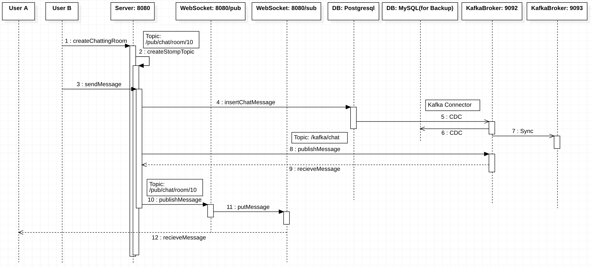

# 실시간 채팅방 구현
실질적으로 Kafka를 연동하기에 앞서 아래의 예상 sequence를 생성하였다.

## Sequence Diagram

## 현재의 프로젝트에 Kafka를 연동함으로써 예상되는 장점
* Kafka Connect의 CDC로 백업 DB Sync 설정가능
> Kafka Connect : 트랜젝션 log CDC(Change Data Capture)로 sync.
* 이전에는 WebSocket으로 Direct하게 메세지를 전송하였다면, Kafka Consumer에서 이를 처리함으로써 메세지 전송 실패시 재전송 가능
* 서버(:8080 포트) 다운 시, kafka의 zooKeeper에서 변화감지 및 Consumer 변경 가능함으로써 서버다운대처가능
* chatting I/O 기다리지 않아도 됨(이는 이미 pub/sub방식 stomp로 처리하면서 해결됨)

아래는 정말 도움 많이 받은 질문
* [https://softwareengineering.stackexchange.com/questions/422177/is-kafka-needed-in-a-realtime-chat-application](https://softwareengineering.stackexchange.com/questions/422177/is-kafka-needed-in-a-realtime-chat-application)

# Reference
1. [https://softwareengineering.stackexchange.com/questions/422177/is-kafka-needed-in-a-realtime-chat-application](https://softwareengineering.stackexchange.com/questions/422177/is-kafka-needed-in-a-realtime-chat-application)
2. [https://www.confluent.io/blog/sync-databases-and-remove-silos-with-kafka-cdc/](https://www.confluent.io/blog/sync-databases-and-remove-silos-with-kafka-cdc/)

