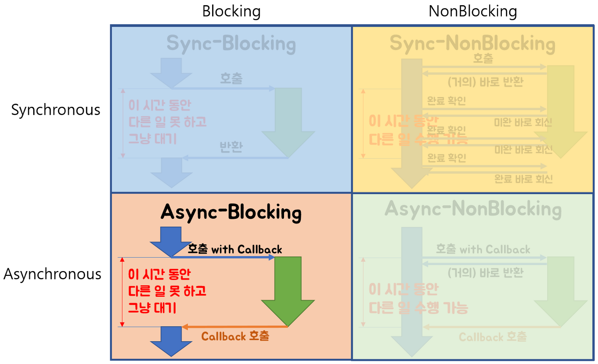

현재까지 **version1 실시간 채팅방 구현을 위한 Kafka/STOMP/Spring 연동이 완료**되었다. 상세한 내용과 코드는 다음의 github 링크에서 확인할 수 있다.

GITHUB : [https://github.com/ghkdqhrbals/spring-chatting-server/tree/v1](https://github.com/ghkdqhrbals/spring-chatting-server/tree/v1)

v1 동작 : [https://www.youtube.com/watch?v=nwD3AX6CJcc](https://www.youtube.com/watch?v=nwD3AX6CJcc)

**하지만 아직 Kafka가 제대로 활용되지 않았고 다른 기능들도 미비하여 추가하려한다.**

**Kafka를 사용하기 이전**에는 아래와 같이 데이터를 주고받는것을 목표로 하였다.
> Kafka 이전에 고려했던 점
> * 프론트에서 WebClient를 사용해서 RestApi호출할 때, Spring의 WebClient를 비동기 + Non-Blocking으로 설계할 것. 이렇게 되면 순서는 다음과 같음.
> 1. 프론트에서 @Async어노테이션으로 비동기 private 함수 호출(이때, websocket으로 `진행중`표시)
> 2. 비동기 함수에서 webClient를 .subscribe(result-> hashset... )로 non-blocking설정하고 **restapi들**(**하나의 api를 호출하는 것은 non-blocking의미가 없다. 호출이 여러개여야지 한방에 다 보내고 wait으로 기다릴 떄, 성능향상을 기대할 수 있기때문**)을 호출하고 wait
> 3. 비동기함수 내 webClient의 response가 도착하면 websocket으로 데이터 표시

**그렇다면 필자는 왜 Kafka를 사용하려할까?**
1. 장애 대응 용이

Kafka는 장애대응이 용이하다. 특정 서버가 죽었을 때, 다른 서버가 데이터를 받아서 처리하도록 설정가능하다. 이는 Kafka가 죽었을 때도 마찬가지이다. 카프카 클러스터 내 특정 데이터 큐(topic-partition)을 도맡아(leader partition) 처리하는 카프카 서버(broker)가 죽어도 다른 카프카 서버 내 싱크된 큐(follow partition)가 대신해서 처리하도록 대장 카프카 서버(controller broker)가 장애를 대응해준다. 이 대장 카프카 서버는 zookeeper에 의해 관리된다.

2. 확장성 용이

카프카는 ConsumerGroup이 데이터(topic)와 매칭되어 데이터를 받을 수 있도록 도와준다. ConsumerGroup은 쉽게 생각해서 같은 기능의 서버(Consumer)를 **수평적으로 확장**해놓은 집합이라고 생각하면 된다. 그리고 이러한 ConsumerGroup내 서버(Consumer)들 중 하나가 죽으면, 그 서버에서 처리하던 특정 데이터(topic-partition)들을 다른 서버가 이어받아 처리하도록 도와준다.

어떤식으로 통신을 해야할까? 일단 Kafka의 topic은 stomp처럼 많이 생성할 수 없다. 이는 broker수만큼 topic의 replica를 감당해야하며, 모든 topic들의 partition(ISR-InSync-Replica)들은 follow partition들과 sync과정을 가지기 때문에 각기 broker에 걸리는 부하는 (총 broker개수)*(topic개수*partition개수) 이상이다. 즉, **topic 개수에 limit에 존재한다**. 무작정 chat.room.10 이런식으로 채팅방 별 topic을 설정할 수 없다는 것이다. 따라서 클라이언트가 직접 publish/consume할 수 없다.

[Is There a Limit on the Number of Topics in a Kafka Instance?](https://support.huaweicloud.com/intl/en-us/kafka_faq/kafka-faq-200426024.html)

그렇다면 이상적인 통신방법은 무엇일까?
> Kafka 통신순서 예시(로컬에서의 채팅방 입장 및 채팅전송)
> * 채팅방 입장
> 1. 클라이언트가 `https://localhost:8080/chat` 으로 살아있는 서버의 웹소켓 엔드포인트 주소 반환요청. 클라이언트는 비동기로 해당 요청을 실행하며, webclient의 .subcribe()으로 non-blocking실행. (Asnyc-NonBlocking은 아래 참조)
> 
> reference : [Blocking-NonBlocking-Synchronous-Asynchronous](https://homoefficio.github.io/2017/02/19/Blocking-NonBlocking-Synchronous-Asynchronous/)
> 2. `https://localhost:8080` 의 nginx에서 round-roubin으로 분산, 연결된 서버인 :8081, :8082, :8083. 얘네들은 producer역할을 수행한다. `https://localhost:9092`의 해당 토픽을 구독하는 consumer은 자신의 웹소켓엔드포인트 `http://localhost:8080/ws-chat`를 kakao.chat.socketRes

!!!!!! 클라이언트에 Consumer을 넣는것은 미친짓 !!!!!!!
그냥 저장 이벤트를 날린다고 생각해야함!!!!!!

## 현재의 프로젝트에 Kafka를 연동함으로써 예상되는 장점
* Kafka Connect의 CDC로 백업 DB Sync 설정가능
> Kafka Connect : 트랜젝션 log CDC(Change Data Capture)로 sync.
* 이전에는 WebSocket으로 Direct하게 메세지를 전송하였다면, Kafka Consumer에서 이를 처리함으로써 메세지 전송 실패시 재전송 가능
* 서버(:8080 포트) 다운 시, kafka의 zooKeeper에서 변화감지 및 Consumer 변경 가능함으로써 서버다운대처가능

## 추가할 작업

* Chatting 메세지를 저장하는 Repository 추가
> 고려할 점
> 1. 사용자가 **마지막에 읽은 채팅의 위치를 저장하는 칼럼 추가**
> 2. 지금 채팅방에 입장할때마다 입장메세지가 표시된다. 이것을 삭제하고 입장메세지의 토픽인 /pub/chat/enter의 핸들러를 거칠때마다 **마지막 읽은 메세지의 위치 표시(반환)**
> 3. 카카오의 `톡서랍`처럼 나한테 중요한 메세지들을 채팅방,채팅메세지,시간 이렇게 저장할 수 있도록 **중요메세지 저장 테이블 추가**

* Room/Participant 제거기능 추가

* User가 삭제되었을 때, 연관된 데이터 삭제하도록 데이터 흐름 관찰(JPA실제 쿼리문 관찰)

* Kafka 설정
  * **UserServer/FriendServer/ChattingServer 전부 따로 떼서 Kafka를 통해 서로 메세지를 주고받도록 설정**
> 고려할 점
> * **UserServer/FriendServer/ChattingServer** 모두 RestApi로 설계할 것
> * 프론트에서 WebClient를 사용해서 RestApi호출할 때, Spring의 WebClient를 비동기 + Non-Blocking으로 설계할 것. 이렇게 되면 순서는 다음과 같음.
>   1. 프론트에서 @Async어노테이션으로 비동기 private 함수 호출(이때, websocket으로 `진행중`표시)
>   2. 비동기 함수에서 webClient를 .subscribe(result-> hashset... )로 non-blocking설정하고 **restapi들**(**하나의 api를 호출하는 것은 non-blocking의미가 없다. 호출이 여러개여야지 한방에 다 보내고 wait으로 기다릴 떄, 성능향상을 기대할 수 있기때문**)을 호출하고 wait
>   3. 비동기함수에서 값이 다 도착하면 websocket으로 데이터 표시
>
> 근데 다시 생각해보니
>
> * 현재 Consumer은 하나이며, **logging하는 서버를 추가**로 Consumer로 지정하려한다
> * Partition + Broker 추가
> * Docker-compose로 Kafka/DB/Spring 구동 편리성 도모
> * Spring 서버 다운 시, 대책마련
> * 메시지가 소비될 떄, 멱등성 고려해야함
> * ElasticSearch LoggingServer 추가

아래는 정말 도움 많이 받은 질문
* [https://softwareengineering.stackexchange.com/questions/422177/is-kafka-needed-in-a-realtime-chat-application](https://softwareengineering.stackexchange.com/questions/422177/is-kafka-needed-in-a-realtime-chat-application)

# Reference
1. [https://softwareengineering.stackexchange.com/questions/422177/is-kafka-needed-in-a-realtime-chat-application](https://softwareengineering.stackexchange.com/questions/422177/is-kafka-needed-in-a-realtime-chat-application)
2. [https://www.confluent.io/blog/sync-databases-and-remove-silos-with-kafka-cdc/](https://www.confluent.io/blog/sync-databases-and-remove-silos-with-kafka-cdc/)
