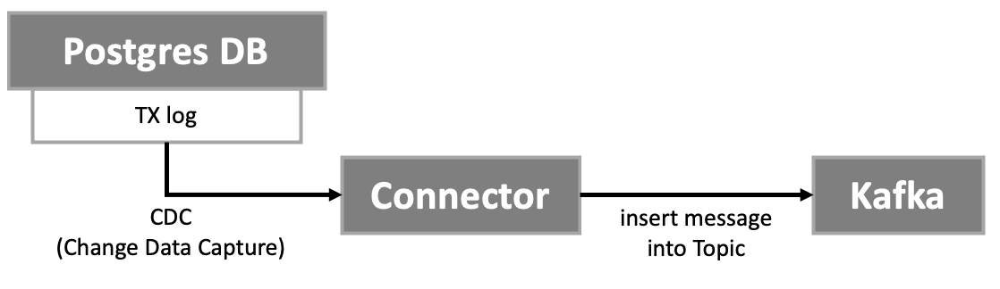
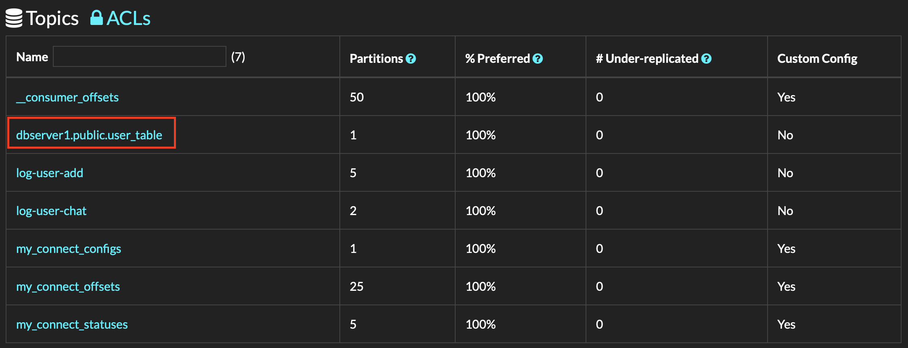
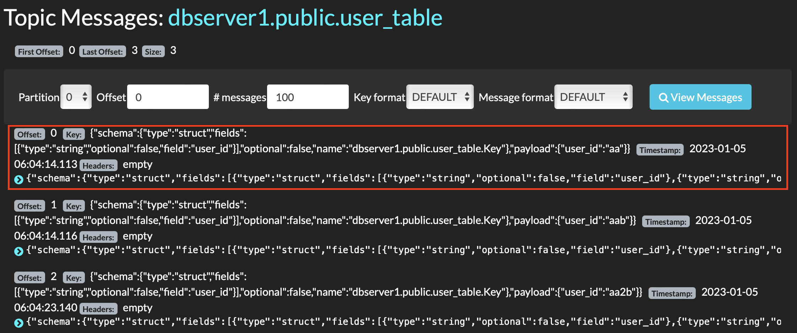

# INDEX
1. DB sync 시 고려할점
2. 어떻게 두 개의 master DB를 sync 해야할까?


앞서 연동에 추가할 부분이 있다. 채팅서비스를 두개로 실행하는데, 문제는 DB가 서로 독립이라는 점이다. 따라서 두 개중, 어느 DB가 INSERT/ALTER 등이 된다면 다른 DB도 같은 트랜젝션을 수행해야한다. 즉, 분산 DB이면서 서로 sync되도록 해야된다.
> 이렇게 DB를 따로 뗀 이유는 수평확장시키기 좋기 때문이다. 이러한 두 개의 DB 모두 master DB로 수행된다.

# 1. DB sync 시 고려할점
이 부분에서 고려할 점은 다음과 같다.
* 백업 DB처럼 단반향 sync가 아닌 양방향 sync 를 해야하기 때문에 서로 맞물리는 **무한루프를 조심**해야한다.
> 보통 Source/Target DB를 정하고 CDC(Change Data Capture)후 Sync를 하는경우가 대부분이다.
> 양방향 sync는 좀더 까다로운것 같다. 아래는 양방향에 있어 발생가능한 이슈 및 해결방법이다.
>
> Second, you'll need to make sure to **not propagate the same data change forth and back in an infinite loop**. One way of doing so could for instance be an **SMT(단일 메시지 변환) which you apply to both sources and which adds a Kafka Connect header property representing the "origin" of a given change**. In your sink connector, you'd then add that origin as an additional column to your data as you update it. The source connector on that side would then have to be set up (e.g. again using an SMT) to ignore all the changes which originate from replication, as opposed to actual data changes e.g. done by a business application.
>
> Issue from [https://groups.google.com/g/debezium/c/YS22DAgFXSc](https://groups.google.com/g/debezium/c/YS22DAgFXSc)


### 1-1. 여기서 SMT란?

> Single Message Transforms (SMTs) is a Kafka API that provides a simple interface for manipulating records as they flow through both the source and sink side of your data pipeline.
>
> reference [https://camel.apache.org/camel-kafka-connector/3.18.x/reference/transformers/index.html](https://camel.apache.org/camel-kafka-connector/3.18.x/reference/transformers/index.html)

위의 레퍼런스를 번역하자면 SMTs는 `source connector`->`sink connector` 로 sync할 때, 레코드의 칼럼명이나 value 등을 변경시켜서 전달해주는 kafka 편의기능 rest api 이다. 아래는 다양한 변환방법이다.

> Some common uses for transforms are:
>
>* [Renaming fields](https://docs.confluent.io/platform/current/connect/transforms/replacefield.html#replacefield)( 칼럼명 재정의 )
>* [Masking values](https://docs.confluent.io/platform/current/connect/transforms/maskfield.html#maskfield)( 특정 칼럼의 value를 **valid null**로 만듬 ex) {value} to 0 or "" or false )
>* Routing records to topics based on a value( cloud 에서는 안됨 )
>* [Converting or inserting timestamps into the record](https://docs.confluent.io/platform/current/connect/transforms/timestampconverter.html#timestampconverter)
>* [Manipulating keys, like setting a key from a field’s value](https://docs.confluent.io/platform/current/connect/transforms/valuetokey.html#description)( 카프카는 key를 통해 원하는 메세지를 가져올 수 있다. 이 방법은 특정 칼럼의 value를 key로 변환해주는 방법이다 )
>
> reference [https://www.confluent.io/blog/kafka-connect-single-message-transformation-tutorial-with-examples/?_ga=2.130915337.76772118.1672804235-1001218784.1670749352&_gac=1.191662808.1671423652.CjwKCAiAkfucBhBBEiwAFjbkr7Bq_5Npm8yLue-N4DKIv4hpPc44IdpcBYN3ITQzeAAdIkGX2Y5wJRoCBYIQAvD_BwE](https://www.confluent.io/blog/kafka-connect-single-message-transformation-tutorial-with-examples/?_ga=2.130915337.76772118.1672804235-1001218784.1670749352&_gac=1.191662808.1671423652.CjwKCAiAkfucBhBBEiwAFjbkr7Bq_5Npm8yLue-N4DKIv4hpPc44IdpcBYN3ITQzeAAdIkGX2Y5wJRoCBYIQAvD_BwE)

# 2. 어떻게 두 개의 master DB를 sync 해야할까?
필자는 Kafka connector을 이용하여 싱크를 맞추려한다. 그러기 위해서는 Kafka connector에 대한 이해가 바탕이 되어야한다.

## 2-1. Kafka connector란?
Kafka connector의 기본적인 플로우는 다음과 같다.

1. RDB에 INSERT/UPDATE/ALTER 등 변경되는 트랜젝션이 실행되고 TXlog에 기록된다
2. Kafka Connector은 이를 읽고(CDC) Kafka의 Topic에 삽입한다

이 때 이 connector을 우리는 **source conenctor**이라고 부른다. 그리고 `Kafka ---> DB`를 연결시켜주는 connector은 **sink connector**이라고 부른다.

일단 먼저 Kafka source connector을 설정해보고, kafdrop으로 실제 CDC되는지 관찰해보자

## 2-2. Kafka **Source** connector setting
Kafka soruce connector은 아래의 4가지 과정을 거쳐 설정 및 확인할 수 있다.

1. postgres wal_level 설정
2. debezium connector 설정
3. connector kafka 등록
4. DB에 값 추가했을 떄 실제로 Kafka로 흘러가는지 확인

### 2-2-1. postgres wal_level 설정
* 먼저 wal-level이 무엇일까?

WAL은 Write-Ahead Logging의 약자로 **트랜젝션로그에 어떤식으로 변경된 사항을 저장할 지 정하는 설정**이다.

WAL은 크게 Logical과 Replica가 존재한다.

* Logical level : 레코드 값이 변경되면, 변경된 레코드 전체를 트랜젝션 로그에 저장한다.
* Replica level : 레코드 값이 변경되면, 변경된 레코드 값 부분만 트랜젝션 로그에 저장한다.

그리고 이러한 WAL level은 postgres에서는 기본적으로 replica로 설정되어있다. 이 replica level은 debezium kafka connector에서는 지원하지 않는다. 즉, 레코드 전체값이 적혀있는 트랜젝션 로그(logical level)를 보고 CDC하도록 설정되어있다. 따라서 우리는 이 default replica level을 logical로 아래와같이 바꿔줘야한다.

```dockerfile
  chatting-db-2:
    container_name: chatting-db-2
    image: postgres:12-alpine
    environment:
      - POSTGRES_PASSWORD=password
      - POSTGRES_USER=postgres
      - POSTGRES_DB=chat
    expose:
      - "5434" # Publishes 5433 to other containers but NOT to host machine
    ports:
      - "5434:5434"
    volumes:
      - ./backups:/home/backups
    command: -c wal_level=logical -p 5434 <--- logical로 변경
```


### 2-2-2. debezium connector 설정

이제 DB설정은 끝났고, DB의 트랜젝션 로그의 변경사항을 관찰(CDC)하고 Kafka 토픽에 삽입해주는 connector을 컨테이너로 아래와 같이 띄울 것이다.

```dockerfile
  # -------- postgres -> kafka source connector --------
  kafka-source-connector:
    image: debezium/connect:1.9
    container_name: postgres-kafka-source-connector
    ports:
      - 8083:8083
    environment:
      CONFIG_STORAGE_TOPIC: my_connect_configs
      OFFSET_STORAGE_TOPIC: my_connect_offsets
      STATUS_STORAGE_TOPIC: my_connect_statuses
      BOOTSTRAP_SERVERS: kafka1:9092,kafka2:9092,kafka3:9092
    depends_on:
      - kafka1
      - kafka2
      - kafka3
      - zookeeper
      - chatting-db-2
```

### 2-2-3. connector kafka 등록

이렇게 DB, Connector-Kafka 을 띄웠다면 이제는 서로 연결해주어야할 차례이다. 우리는 Kafka connector가 지원하는 restapi를 통해 연결시켜줄 수 있다.

```
POST http://localhost:8083/connectors
{
    "name": "chatting-5434-connector2",
    "config": {
        "connector.class": "io.debezium.connector.postgresql.PostgresConnector",
        "plugin.name": "pgoutput",
        "database.hostname": "chatting-db-2", <--- 컨테이너 명
        "database.port": "5434",
        "database.user": "postgres",
        "database.password": "password",
        "database.dbname" : "chat",
        "database.server.name": "dbserver1"
    }
}
```

### 2-2-4. DB에 값 추가했을 떄 실제로 Kafka로 흘러가는지 확인

이제는 실제로 확인해 볼 차례이다. 우리는 다음과 같이 확인해볼것이다.
This is final process.


1. POST to server

    ```
    POST http://localhost:8080/chat/user
    {
      "userId":"aa",
      "userName":"황보규민"
    }
    ```

2. In docker container log

    ```
    chatting-server-2         | 2023-01-05 05:55:07.829  INFO 1 --- [ad | producer-1] chatting.chat.web.ChatController         : 메세지 전송 성공 topic=log-user-add, offset=0, partition=2
    ```

3. See kafka with Kafdrop

    

    

아래는 발생한 에러와 해결한 방법에 대해 정리했다.

* 이슈

  ```
  Connector configuration is invalid and contains the following 1 error(s) Error while validating connector config: Connection to localhost:5434 refused
  ```

* 이슈 해결방법 정리 : [https://github.com/ghkdqhrbals/spring-chatting-server/issues/1](https://github.com/ghkdqhrbals/spring-chatting-server/issues/1)

## 2-3. Kafka **Sink** connector setting
자! 이제 DB->Kafka는 완료되었으니, Kafka->DB로 Sink connector을 구축해야한다.

# Reference
* [https://www.confluent.io/blog/sync-databases-and-remove-silos-with-kafka-cdc/](https://www.confluent.io/blog/sync-databases-and-remove-silos-with-kafka-cdc/)
* [One way DB sync](https://dbconvert.com/blog/what-is-database-synchronization/)
* [Bi-directional DB sync](https://dbconvert.com/blog/bidirectional-database-synchronization/)
