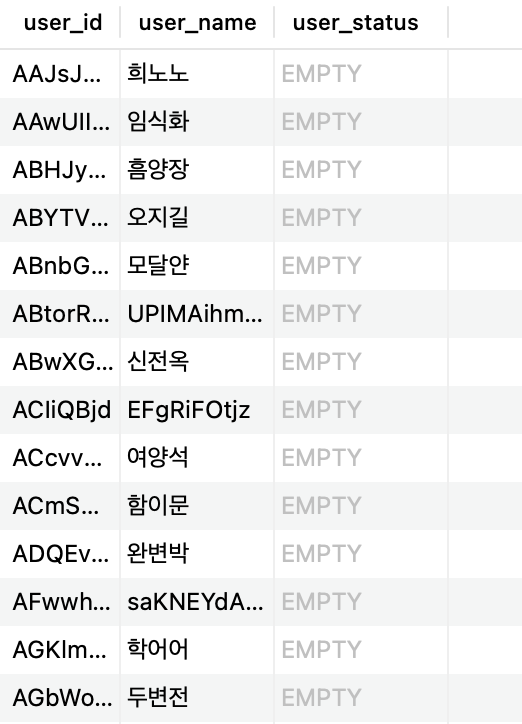

# INDEX
* 랜덤값으로 test하는 code
* 10000개 rest api 트래픽 실행(110초 소요)


이제 동시 연결가능한 TCP 소켓을 필자의 맥북이 버틸 수 있는만큼 열어서 다량의 http request를 서버로 전송해볼려고 한다.

```golang
	t := http.DefaultTransport.(*http.Transport).Clone()
	t.MaxIdleConns = 10000
	t.MaxConnsPerHost = 10000
	t.MaxIdleConnsPerHost = 1

	// 클라이언트 설정 및 timeout
	client := &http.Client{
		Timeout:   1 * time.Second,
		Transport: t,
	}
```

Transport 설정을 잠깐 설명하자면 아래와 같다.

1. MaxIdleConns : 전체 커넥션 풀
2. MaxConnsPerHost : 호스트 별(서버) 할당 가능한 커넥션 개수
3. **MaxIdleConnsPerHost** : 호스트 별 활성화 되지 않아도 유지하는 최대 connection 개수.(Server-Sent Event같이 클라이언트가 따로 뭘 안보내도 서버가 계속 보내야 될 때 필요하다. 본 테스트에서는 필요업으니 pass)
4. Dial.Timeout = tcp 소켓 유지 타임아웃(Keep-alive 시간) - http.Client.Timeout랑 같다.
5. http.Client.Timeout : 클라이언트(테스트 클라이언트)가 송신/수신이 끝나면 connection 유지하는 시간

현재 필자의 맥북은 약 tcp 소켓을 동시에 10K까지는 무난히 열 수 있다. 따라서 10K로 커넥션 풀을 설정한다. 또한 status code 200을 수신받기 위한 수정된 코드를 실행하며 스레드는 100개로 실행한다.

## 랜덤값으로 test하는 code

```golang
...
type User struct {
	UserId   string `json:"userId"`
	UserName string `json:"userName"`
	Email    string `json:"email"`
	UserPw   string `json:"userPw"`
}
type Usera struct {
	Name string
}

func init() {
	rand.Seed(time.Now().UnixNano())
}

var letterRunes = []rune("김이박최정강조윤장임한오서신권황안송류전홍고문양손배조백허유남심노정하곽성차주우구신임나전민유진지엄채원천방공강현함변염양변여추노도소신석선설마길주연방위표명기반왕금옥육인맹제모장남탁국여진어은편구용")
var letterRunes_name = []rune("가강건경고관광구규근기길나남노누다단달담대덕도동두라래로루리마만명무문미민바박백범별병보빛사산상새서석선설섭성세소솔수숙순숭슬승시신아안애엄여연영예오옥완요용우원월위유윤율으은의이익인일잎자잔장재전정제조종주준중지진찬창채천철초춘충치탐태택판하한해혁현형혜호홍화환회효훈휘희운모배부림봉혼황량린을비솜공면탁온디항후려균묵송욱휴언령섬들견추걸삼열웅분변양출타흥겸곤번식란더손술훔반빈실직흠흔악람뜸권복심헌엽학개롱평늘늬랑얀향울련")

const letterBytes_id = "abcdefghijklmnopqrstuvwxyzABCDEFGHIJKLMNOPQRSTUVWXYZ"

func RandStringBytes(n int, letterBytes string) string {
	b := make([]byte, n)
	for i := range b {
		b[i] = letterBytes[rand.Intn(len(letterBytes))]
	}
	return string(b)
}

func RandStringRunes_firstname(n int) string {
	b := make([]rune, n)
	for i := range b {
		b[i] = letterRunes[rand.Intn(len(letterRunes))]
	}
	return string(b)
}

func RandStringRunes_lastname(n int) string {
	b := make([]rune, n)
	for i := range b {
		b[i] = letterRunes_name[rand.Intn(len(letterRunes_name))]
	}
	return string(b)
}

func worker(contexts *sync.Map, wg *sync.WaitGroup, requestURL string, jsonBody []byte, client *http.Client, transferRatePerSecond int, number_worker int) {
	defer wg.Done()
	fmt.Println("Threads start:", number_worker)
	// 로컬 맵 생성
	m := make(map[int]int)

	for i := 0; i < transferRatePerSecond; i++ {
		s := &User{
			UserId:   RandStringBytes(8, letterBytes_id),
			UserName: RandStringRunes_lastname(1) + RandStringRunes_firstname(2),
			Email:    RandStringBytes(5, letterBytes_id) + "@gmail.com",
			UserPw:   RandStringBytes(10, letterBytes_id),
		}
		buf, err := json.Marshal(s)
		if err != nil {
			log.Fatal(err)
			return
		}
		bodyReader := bytes.NewReader(buf)
		// 요청 생성
		req, err := http.NewRequest(http.MethodPost, requestURL, bodyReader)
		if err != nil {
			os.Exit(1)
		}

		// json 헤더 설정
		req.Header.Set("Content-Type", "application/json")

		// 실제 요청 전송 및 반환
		res, _ := client.Do(req)

		// 로컬 맵에 삽입
		m[res.StatusCode] += 1
	}

	for k, v := range m {
		result, ok := contexts.Load(k)
		if ok {
			contexts.Store(k, result.(int)+v)
		} else {
			contexts.Store(k, v)
		}
	}

}

func main() {

	argsWithoutProg := os.Args[1:]
	var wg sync.WaitGroup

	number_worker := 100
	// http 전송 url
	requestURL := argsWithoutProg[0]

	// json 파일 경로 ex) user
	// .json 확장자 명은 제외
	jsonReq := argsWithoutProg[1]

	// 실행횟수 설정
	transferRatePerSecond, _ := strconv.Atoi(argsWithoutProg[2])

	// JSON 파일 읽기
	jsonFile, err := os.Open(jsonReq + ".json")
	if err != nil {
		fmt.Println(err)
	}
	defer jsonFile.Close()

	t := http.DefaultTransport.(*http.Transport).Clone()
	t.MaxIdleConns = 10000    // connection pool 크기
	t.MaxConnsPerHost = 10000 // 호스트 별 최대 할당 connection
	t.MaxIdleConnsPerHost = 1

	// 클라이언트 설정 및 timeout
	client := &http.Client{
		Timeout:   5 * time.Second,
		Transport: t,
	}

	// json파일을 바이트로 변환
	jsonBody, _ := ioutil.ReadAll(jsonFile)

	// 스레드 싱크 맵
	var contexts = &sync.Map{}

	// 멀티 스레드 http request
	for i := 0; i < number_worker; i++ {
		wg.Add(1)
		go worker(contexts, &wg, requestURL, jsonBody, client, transferRatePerSecond/number_worker, i)
	}

	wg.Wait()

	// 성공한 http request 개수 확인
	contexts.Range(func(k, v interface{}) bool {
		fmt.Println("status: ", k, " count: ", v)
		return true
	})
}
```

## 10000개 쿼리 실행 결과(110초 소요)

결과로 빠짐없이 정상 200 code 를 받는것을 확인할 수 있으며, db에도 값에 정상저장되는 것을 확인할 수 있다.

* terminal
```
gyuminhwangbo@Gyuminui-MacBookPro testing % go run main.go 10000
실행시간 110.251228122
status:  200  count:  10000
```

* auth DB


* chat DB


* backup DB - chat DB



