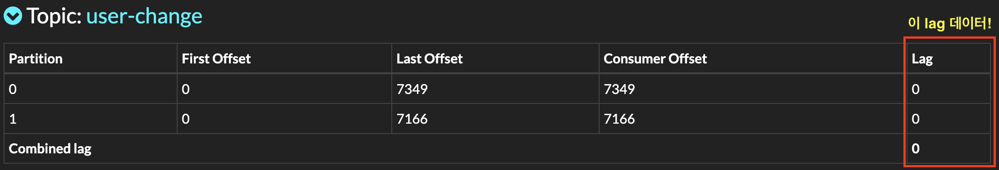

이전 포스팅에서 10000개의 rest api를 직접 test해보았다. 로직에는 문제가 없지만 성능이슈가 너무 나버렸다.
**10000개 테스트 하는데 110초**가 걸린것이다. 의심가는 부분이 한두군데가 아니다. 오늘의 포스팅은 의심가는 부분을 한번 정리해보려한다.

# 의심가는 부분
1. Golang Code의 http request시 속도
2. Auth Server에서의 SQL처리
3. Auth Server -> Kafka -> Chat Server -> Chat DB 과정
4. Chat DB(tx log) -> Debezium -> Kafka -> JDBC-Sink-Connector -> Backup DB 과정
5. 약 10개의 토픽과 각각의 토픽이 1~25개의 파티션을 보유함에 따라 3대의 Kafka broker끼리 미친듯한 replication 생성
  > Kafka의 lag 데이터를 따로 통계내는 Grafana를 사용해봐야겠다.
  > 
6. Chat/Auth Server 쿼리 튜닝 미적용
7. 그냥 느린 필자의 맥북...

  | MacBook Pro (13-inch, 2020, Four Thunderbolt 3 ports) |
  |:-----------------------------------------------------|
  | Processor : 2 GHz 쿼드 코어 Intel Core i5                |
  | Memory : 32GB 3733 MHz LPDDR4X                       |

  * 아래는 실행중인 컨테이너들(ELK 제외)

    ```
    CONTAINER ID   IMAGE                                      COMMAND                  CREATED       STATUS          PORTS                              NAMES
    106632f507d6   spring-chatting-server_nginx               "/docker-entrypoint.…"   3 hours ago   Up 3 hours      0.0.0.0:8080->80/tcp               nginx
    2bf0b2d9d11f   spring-chatting-server_chatting-server-2   "java -jar app.jar"      3 hours ago   Up 3 hours      0.0.0.0:8084->8084/tcp             chatting-server-2
    9a3ee9e3c228   debezium/connect:1.9                       "/docker-entrypoint.…"   3 hours ago   Up 11 minutes   0.0.0.0:8083->8083/tcp, 9092/tcp   postgres-kafka-source-connector
    be3941b503ef   obsidiandynamics/kafdrop                   "/kafdrop.sh"            3 hours ago   Up 3 hours      0.0.0.0:9000->9000/tcp             spring-chatting-server_kafdrop_1
    a350a45bf411   confluentinc/cp-kafka:7.2.1                "/etc/confluent/dock…"   3 hours ago   Up 3 hours      0.0.0.0:8097->8097/tcp, 9092/tcp   kafka1
    a5a08e9d22e2   confluentinc/cp-kafka:7.2.1                "/etc/confluent/dock…"   3 hours ago   Up 3 hours      0.0.0.0:8098->8098/tcp, 9092/tcp   kafka2
    39f38c43014b   confluentinc/cp-kafka:7.2.1                "/etc/confluent/dock…"   3 hours ago   Up 3 hours      0.0.0.0:8099->8099/tcp, 9092/tcp   kafka3
    c7a7d3348e95   spring-chatting-server_auth-server         "java -jar app.jar"      3 hours ago   Up 3 hours      0.0.0.0:8085->8085/tcp             auth-server
    27fbc55d2c4b   postgres:12-alpine                         "docker-entrypoint.s…"   3 hours ago   Up 3 hours      5432/tcp, 0.0.0.0:5434->5434/tcp   chatting-db-2
    6c4daf252a58   postgres:12-alpine                         "docker-entrypoint.s…"   3 hours ago   Up 3 hours      5432/tcp, 0.0.0.0:5435->5435/tcp   auth-db
    85802ac586a8   postgres:12-alpine                         "docker-entrypoint.s…"   3 hours ago   Up 3 hours      5432/tcp, 0.0.0.0:5433->5433/tcp   chatting-db-1
    552d8ae697cc   confluentinc/cp-zookeeper:7.2.1            "/etc/confluent/dock…"   3 hours ago   Up 3 hours      2181/tcp, 2888/tcp, 3888/tcp       zookeeper
    ```


