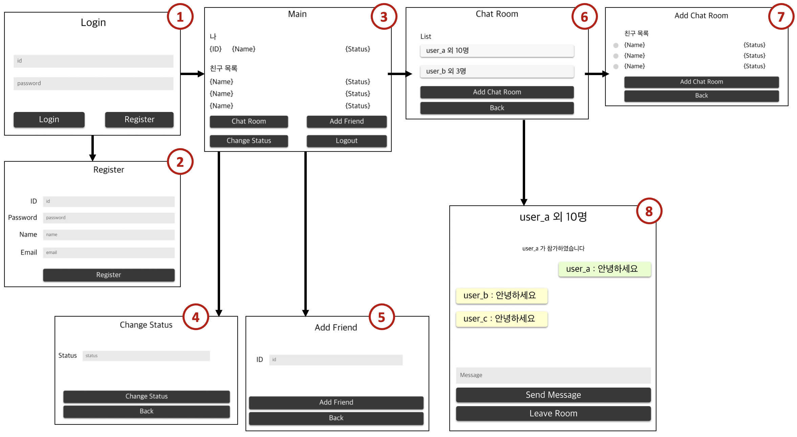
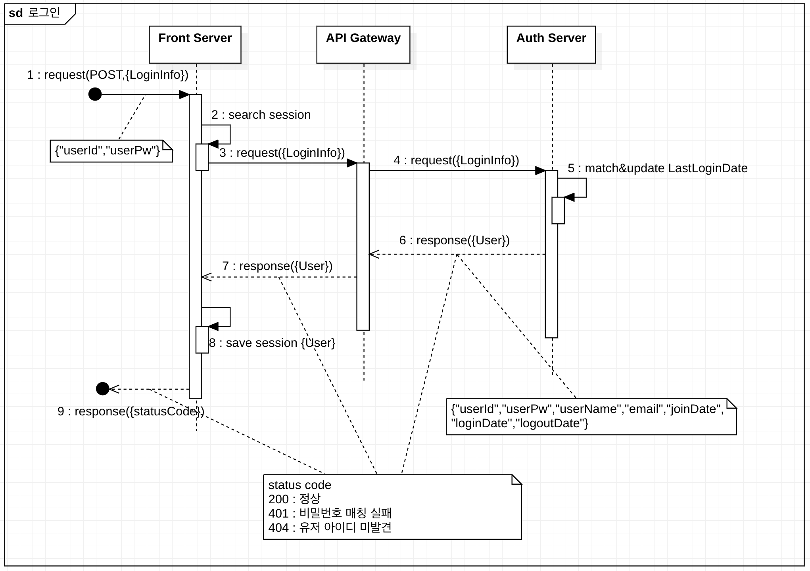
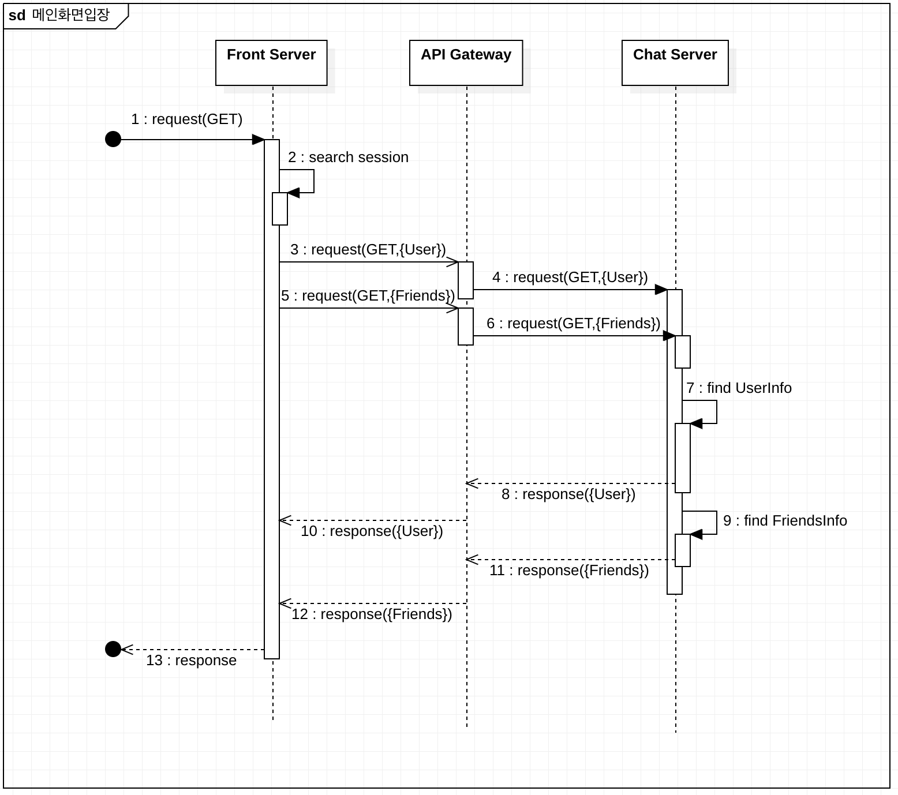
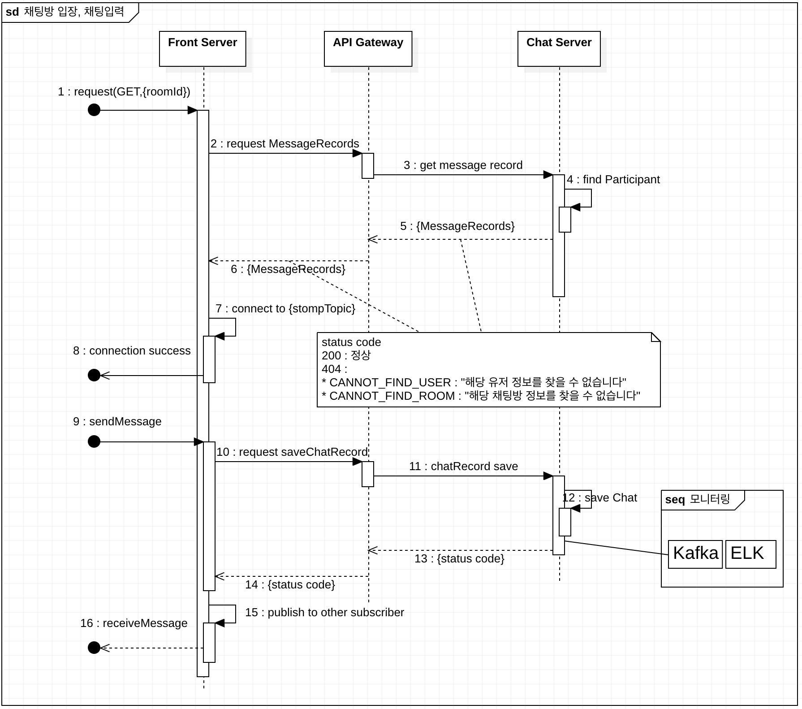

# INDEX(프론트 서버 설계)
* 예상 UI
* 시퀀스 다이어그램
* 프론트 HTTP request/response 비동기 or Non-blocking?

## 예상 UI
앞서 우리는 API Gateway까지 백엔드 전체를 생성했다. 이제 실제 body와 uri를 게이트웨이에 전송하는 프론트 서버를 만들어 볼 것이다.

먼저 Protopie 툴을 통해서 간단히 예상되는 UI를 만들고 시뮬레이션 해보았다.

* 화면목록
  * 1 : 로그인
  * 2 : 회원등록
  * 3 : 메인
  * 4 : 상태메세지 변경
  * 5 : 친구 추가
  * 6 : 채팅방 목록
  * 7 : 채팅방 추가
  * 8 : 채팅방

## 시퀀스 다이어그램

간단하게 1~3, 8화면의 플로우를 시퀀스 다이어그램으로 나타내보았다.
> 3~7 화면의 시퀀스는 반복이라 따로 그리지는 않았다.

### 로그인(1)

> 1. `Front Server` 는 `클라이언트` 로부터 유저ID 및 PW가 담긴 POST 요청을 수신한다
> 2. `Front Server` 는 세션을 확인한다
> 3. 세션에 유저 정보가 없다면, `백엔드 게이트웨이`(NGINX:http://localhost:8080/auth/login)에 GET 요청을 전송한다
> 4. `백엔드 게이트웨이` 는 ip_hash로 `Auth Server` 중 하나에 전달한다
> 5. `Auth Server` 는 비밀번호와 매칭된 유저ID를 DB에서 검색 후 매칭시킨다(+loginDate 업데이트)
>    * 비밀번호 매칭 x : INVALID_PASSWORD(401, "잘못된 비밀번호입니다")를 반환
>    * 유저ID 미발견 : CANNOT_FIND_USER(404, "해당 유저 정보를 찾을 수 없습니다")를 반환
> 6. 매칭된 User정보 및 StatusCode=200 반환
> 7. 매칭된 User정보 및 StatusCode=200 반환
> 8. `Front Server` 는 200 도착하면 세션에 유저를 저장한다
> 9. `Front Server` 는 `클라이언트` 에게 반환

### 로그아웃(1-1)

> 1. `Front Server` 는 `클라이언트` 로부터 유저ID가 담긴 POST 요청을 수신한다
> 2. `Front Server` 는 세션을 확인한다
>    * 세션에 저장된 유저정보가 없음 : CANNOT_FIND_USER_IN_SESSION(NOT_FOUND, "세션에서 해당 유저 정보를 찾을 수 없습니다")를 반환
> 3. `Front Server` 는 http://localhost:8080/auth/logout 에 유저ID와 함께 POST 요청
> 4. `백엔드 게이트웨이` 는 http://auth-server-1:8082/auth/logout 로 프록시 패스
> 5. `Auth Server` 은 해당 유저의 logoutDate 업데이트
>    * 유저ID 미발견 : CANNOT_FIND_USER(NOT_FOUND, "해당 유저 정보를 찾을 수 없습니다")를 반환
> 6. statusCode만 반환
> 7. statusCode만 반환
> 8. statusCode만 반환

### 회원등록(2)

> 1. `Front Server` 는 `클라이언트` 로부터 유저ID/유저PW/유저이름/이메일 이 담긴 POST 요청을 수신한다
> 2. `백엔드 게이트웨이` 에 전달
> 3. `백엔드 게이트웨이` 는 http://auth-server-1:8082/auth/user 로 프록시 패스
> 4. `Auth Server` 은 유저ID가 기존에 존재하는지 확인하고 저장
> 5. (Async-1) kafka의 `user-change` 토픽(partition:2,replica:3)에 같은 파티션(key=userId)으로 메세지 전송
>    * 중복되는 유저 ID 발견 : DUPLICATE_USER_RESOURCE(409, "유저 데이터가 이미 존재합니다")를 반환
> 6. 등록된 유저정보를 반환
> 7. (Async-2) `Chat Server` 은 3대의 kafka Broker로부터 `user-change` 토픽을 읽음
> 8. 등록된 유저정보를 반환
> 9. (Async-3) `Chat Server` 은 유저의 INSERT/DELETE를 감지하여 자신의 DB에 SYNC
> 10. 등록된 유저정보를 반환

### 메인화면 입장(3)

> 1. `Front Server` 는 `클라이언트` 로부터 GET 요청을 수신한다
> 2. `Front Server` 는 세션을 확인한다
>    * 세션에 저장된 유저정보가 없음 : CANNOT_FIND_USER_IN_SESSION(NOT_FOUND, "세션에서 해당 유저 정보를 찾을 수 없습니다")를 반환
> 3. `Front Server` 는 http://localhost:8080/chat/user 에 userId를 포함한 GET 요청
> 4. `Front Server` 는 http://localhost:8080/chat/friend 에 userId를 포함한 GET 요청
> 5. `백엔드 게이트웨이` 는 http://chat-server-1:8084/chat/user 로 프록시 패스
> 6. `백엔드 게이트웨이` 는 http://chat-server-1:8084/chat/friend 로 프록시 패스
> 7. `Chat Server` 은 userId와 매칭되는 유저 레코드 확인
> 8. 유저 레코드 반환
> 9. `Chat Server` 은 userId와 매칭되는 친구 레코드 확인
> 10. 유저 레코드 반환
> 11. 친구 레코드 반환
> 12. 친구 레코드 반환
> 13. View 반환

### 채팅방 입장 및 채팅입력(8)

> 1. `Front Server` 는 `클라이언트` 로부터 roomId가 포함된 GET 요청을 수신한다
> 2. `Front Server` 는 세션 유저정보 로드 후, http://localhost:8080/chat/chats 로 userId/roomId가 포함된 이전 채팅기록 조회를 요청한다
>   * 세션에 저장된 유저정보가 없음 : CANNOT_FIND_USER_IN_SESSION(NOT_FOUND, "세션에서 해당 유저 정보를 찾을 수 없습니다")를 반환
> 3. `백엔드 게이트웨이` 는 http://chat-server-1:8084/chat/chats 로 프록시 패스
> 4. `Chat Server` 은 실제 유저로직 수행
>   * 유저가 해당 채팅방에 참여하지 않음 : INVALID_PARTICIPANT(400, "해당 채팅방에 참여하는 유저가 아닙니다")를 반환
>   * 유저가 없음 : CANNOT_FIND_USER(NOT_FOUND, "해당 유저 정보를 찾을 수 없습니다")를 반환
>   * 채팅방이 없음 : CANNOT_FIND_ROOM(NOT_FOUND, "해당 채팅방 정보를 찾을 수 없습니다") 반환
> 5. 이전 채팅기록 반환
> 6. 이전 채팅기록 반환
> 7. STOMP 토픽(sub/chat/{roomId})에 연결
> 8. 연결성공 반환
> 9. `Front Server` 는 `클라이언트` 로부터 roomId/writer/writerId/message 가 포함된 POST 요청을 수신한다
> 10. `Front Server` 는 http://localhost:8080/chat/chat 으로 POST 전송
> 11. `백엔드 게이트웨이` 는 http://chat-server-1:8084/chat/chat 로 프록시 패스
> 12. `Chat Server` 는 채팅저장 + Kafka의 `log-add-chat` 토픽에 메세지 전달(이 후 ELK로 모니터링)  
> 13. status code를 반환
> 14. status code를 반환
> 15. `Front Server` 는 정상코드 반환 시, STOMP 토픽(sub/chat/{roomId})에 브로드캐스트
> 16. STOMP 토픽을 구독하는 `클라이언트` 들은 메세지 수신

## 프론트 HTTP request/response 비동기 or Non-blocking?

위와 같이 플로우를 미리 생성해놓으면 중간에 빠질 우려가 있는 에러코드 및 기능들을 한눈에 볼 수 있다.

이제 우리가 고려할 것은 프론트에서 API Gateway 로 요청 송신/수신하는 방법이다. 우리는 해당 송/수신에 WebClient를 사용할 것이다. WebClient는 Spring-WebFlux 라이브러리에서 지원하는 비동기-Non blocking 클라이언트이다. 물론 sync 및 blocking 은 기본지원된다. 따라서 어떤 기능을 sync/Async, blocking/non-blocking 처리할 것인지 정하면 된다.

| 기능         | 송신/수신방법                                                          |
|------------|------------------------------------------------------------------|
| 로그인 전송     | sync + blocking                                                  |
| 로그아웃 전송    | Async + non-blocking (response까지 대기할 필요가 없기 때문)                  |
| 유저 추가      | Async + non-blocking (마찬가지로 response 대기 미필요)                     |
| 메인화면 수신    | sync + blocking                                                  |
| 친구 수신      | sync + blocking                                                  |
| 친구 추가      | sync + blocking                                                  |
| 채팅방 추가     | sync + blocking                                                  |
| 채팅방 리스트 수신 | sync + blocking                                                  |
| 이전 채팅 수신   | sync + blocking(카카오 같은 경우에는 local에 미리 저장하는듯 하다)                  |
| 채팅 입력      | Async + non-blocking(서버에 저장되기까지 임시 개인화면에 송출하고, 에러 시 fault 화면 표시) |

